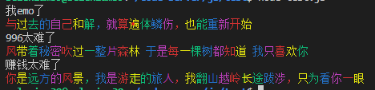

<h1 align="center">Welcome to anti-emo 👋</h1>
<p>
  
  <a href="#" target="_blank">
    
  </a>
</p>

> Life will be better

## Install

```sh
npm install anti-emo
```

## Examples

```sh
const console = require('anti-emo')
console.log('我emo了')
console.log('996太难了')
console.log('赚钱太难了')
```


## Shared
```sh
If by life you were deceived,
Don't be dismal,don't be wild!
In the day of grief,be mild:
Merry days will come,believe.
Heart is living in tomorrow;
Present is dejected here:
In a moment,passes sorrow;
That which passes will be dear.
```


## Author

👤 **Selenium39**


## Show your support

Give a ⭐️ if this project helped you!

***
_This README was generated with ❤️ by [readme-md-generator](https://github.com/kefranabg/readme-md-generator)_
